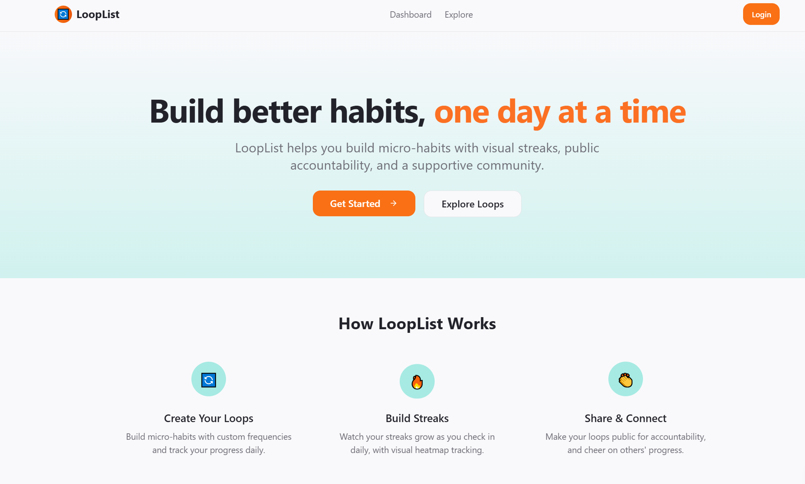
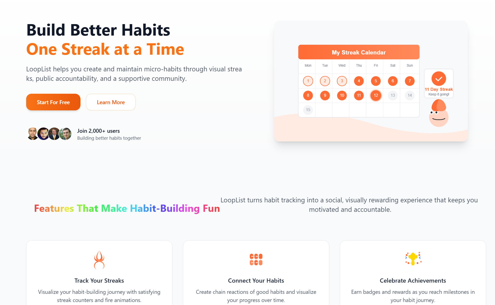
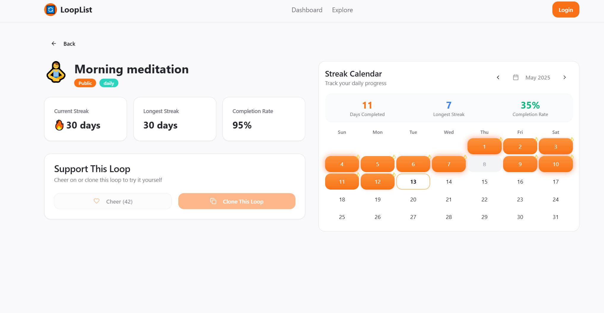
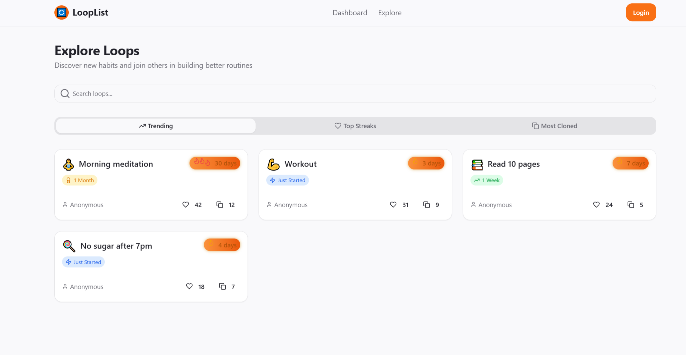

# 🔄 LoopList 🔥

<div align="center">
  
> 🌟 Build better habits, one day at a time! 🌟

[](LICENSE)
[](https://github.com/yourusername/looplist)
[](https://reactjs.org/)
[](https://greensock.com/gsap/)
[](https://tailwindcss.com/)


</div>

## 📝 Description


LoopList is a modern habit tracking application that helps users build micro-habits with visual streak tracking, public accountability, and a supportive community. Perfect for anyone looking to build consistent habits and improve their daily routines.

**"Streaks aren't just numbers – they're stories of your commitment."** 💯

## ✨ Features

- 🔄 **Create Custom Loops** - Create recurring micro-habits with titles, frequency options, and emoji icons
- 🔥 **Streak Tracking** - Check in daily to build streaks with visual heatmap calendar
- 👥 **Social Accountability** - Make loops public for others to see and engage with
- 👏 **Community Support** - Cheer on others' loops and get encouragement for your habits
- 📈 **Progress Metrics** - View your current streak, longest streak, and completion rate
- 🔍 **Explore Trending Loops** - Browse popular loops with filters for most cloned and top streaks
- 📋 **Loop Dashboard** - Manage all your active loops in one centralized dashboard
- 🔄 **Clone & Remix** - Add others' loops to your dashboard with one click
- 📱 **Mobile-Friendly Design** - Enjoy a responsive interface optimized for all devices
- 🎨 **Animated UI Elements** - Experience smooth GSAP animations throughout the app

<div align="center">
  
  <p><em>🤝 Achieve more together with social accountability</em></p>
</div>

## 🏆 Habit Ideas to Get Started

| Habit Type   | Example Loops       | Suggested Frequency |
| ------------ | ------------------- | ------------------- |
| 📚 Reading   | Read 10 pages       | Daily               |
| 🧘 Wellness  | Morning meditation  | Daily               |
| 💪 Fitness   | 20 push-ups         | 3x per week         |
| 🥗 Nutrition | No sugar after 7pm  | Weekdays            |
| 🧠 Learning  | Code for 30 minutes | Daily               |

## 🖼️ Screenshots

<div align="center">
  
  <p><em>✨ Build better habits with LoopList's intuitive interface</em></p>
  
  
  <p><em>📊 Track your progress with a beautiful dashboard view</em></p>
  
  
  <p><em>🔥 Watch your streaks grow in the visual heatmap calendar</em></p>
  
  
  <p><em>🔍 Discover popular habits from the community</em></p>
</div>

## 🔄 How LoopList Works

<div align="center">
  
  <p><em>📈 Track your progress and celebrate consistency</em></p>
</div>

1. **Create Your Loops** - Define micro-habits with custom frequencies and tracking options
2. **Check In Daily** - Build your streak by marking habits as complete each day
3. **Share & Connect** - Make loops public for accountability and community support
4. **Explore & Clone** - Discover trending habits and add them to your dashboard
5. **Stay Motivated** - Watch your streaks grow and receive community encouragement

## 🚀 Installation

### Prerequisites

- 💻 Node.js (v16 or higher)
- 📦 npm or yarn

### Setup Instructions

1. Clone the repository

```bash
git clone https://github.com/yourusername/looplist.git
cd looplist
```

2. Install dependencies

```bash
npm install
# or
yarn install
```

3. Start the development server

```bash
npm run dev
# or
yarn dev
```

## 🔧 Usage

<div align="center">
  <table>
    <tr>
      <td align="center"><strong>📝</strong></td>
      <td>Create your first loop</td>
    </tr>
    <tr>
      <td align="center"><strong>✅</strong></td>
      <td>Check in daily to build your streak</td>
    </tr>
    <tr>
      <td align="center"><strong>🔍</strong></td>
      <td>Explore trending loops for inspiration</td>
    </tr>
    <tr>
      <td align="center"><strong>📋</strong></td>
      <td>Clone loops you like to your dashboard</td>
    </tr>
    <tr>
      <td align="center"><strong>👏</strong></td>
      <td>Cheer on others to spread motivation</td>
    </tr>
    <tr>
      <td align="center"><strong>📊</strong></td>
      <td>Track your progress and celebrate milestones</td>
    </tr>
  </table>
</div>

## 💻 Tech Stack

<div align="center">
  <table>
    <tr>
      <td align="center"><strong>⚛️</strong></td>
      <td>React</td>
      <td>Frontend framework</td>
    </tr>
    <tr>
      <td align="center"><strong>🎨</strong></td>
      <td>Tailwind CSS</td>
      <td>Styling</td>
    </tr>
    <tr>
      <td align="center"><strong>🔄</strong></td>
      <td>GSAP</td>
      <td>Animations</td>
    </tr>
    <tr>
      <td align="center"><strong>🔥</strong></td>
      <td>Firebase</td>
      <td>Authentication & database</td>
    </tr>
    <tr>
      <td align="center"><strong>⚡</strong></td>
      <td>Vite</td>
      <td>Build tooling</td>
    </tr>
  </table>
</div>

## 👥 Contributing


Contributions are always welcome! Please follow these steps:

1. Fork the repository
2. Create a new branch (`git checkout -b feature/amazing-feature`)
3. Make your changes
4. Commit your changes (`git commit -m 'Add some amazing feature'`)
5. Push to the branch (`git push origin feature/amazing-feature`)
6. Open a Pull Request

Please make sure to update tests as appropriate and adhere to the existing coding style.

## 📄 License

This project is licensed under the MIT License - see the LICENSE file for details.

## 🔗 Quick Links

<div align="center">

[](https://loop-list-two.vercel.app/)
[](https://loop-list-two.vercel.app/)
[](https://loop-list-two.vercel.app/)
[](https://loop-list-two.vercel.app/)

</div>

<div align="center">
  
  <p><em>🎉 Celebrate achievements with the LoopList community</em></p>
</div>

## 📞 Contact

- 🌐 Website: [looplist.app]([https://loop-list-two.vercel.app/])
- 📧 Email: shashwatmahender2104@gmail.com
- 🐦 Twitter: [@looplistapp](https://twitter.com/looplistapp)

---

<div align="center">

Made with ❤️ and 🔥 by the Shashwat Mahendra

<em>"The best way to predict your future is to create it, one habit at a time."</em>

</div>
